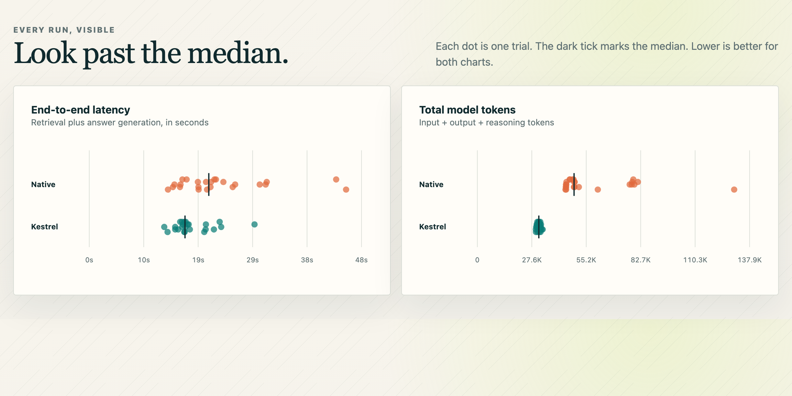
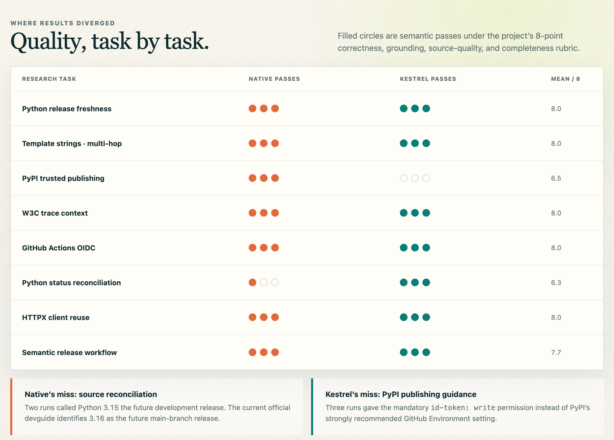

# Kestrel Search

<p align="center">
  
</p>

<p align="center">
  <a href="https://docs.python.org/3.13/"></a>
  <a href="https://docs.astral.sh/ruff/"></a>
  <a href="https://docs.astral.sh/ty/"></a>
  <a href="https://rohaquinlop.github.io/complexipy/"></a>
  <a href="https://kestrel.mintlify.app"></a>
</p>

<p align="center">
  <a href="https://kestrel.mintlify.app">Documentation</a> ·
  <a href="https://kestrel.mintlify.app/installation">Installation</a> ·
  <a href="https://pypi.org/project/kestrelsearch/">PyPI</a> ·
  <a href="#benchmark-kestrel-fanout-vs-native-web-search">Benchmarks</a>
</p>

Kestrel Search brings live, keyless web research to coding assistants. It searches DuckDuckGo, Bing, or Yahoo, retrieves result pages concurrently, extracts their readable content, and re-ranks the results with BM25—all without taking you out of your coding workflow.

Install it once and let your assistant discover the generated `SKILL.md`, or use the pipe-friendly CLI directly. Kestrel can fan out multiple queries across engines or use them as an ordered fallback chain. Results go to stdout and progress goes to stderr, keeping both terminal and JSON workflows clean.

> **Note** Kestrel Search is an independent project and is not affiliated with DuckDuckGo, Microsoft, Bing, or Yahoo.

## Install

Requires Python 3.13 or later.

```bash
# Recommended: install as an isolated CLI with uv
uv tool install kestrelsearch

# Or install with pip
pip install kestrelsearch
```

## Quick start

```bash
# Search, fetch the matching pages, and rank them by relevance
kestrelsearch search "python dataclasses"

# Send structured results to another program or agent
kestrelsearch search "rust ownership" --output json

# A fast snippet-only search, without fetching pages
kestrelsearch search "openai news" --no-fetch
```

## What it does

- Searches DuckDuckGo, Bing, and Yahoo through keyless HTML endpoints.
- Runs multiple queries and engines concurrently in fanout mode, or tries engines in order in fallback mode.
- Retries transient search failures with bounded exponential backoff.
- Fetches a bounded candidate pool concurrently over a shared HTTP/2 client.
- Streams HTML and text responses up to a configurable byte limit before parsing.
- Keeps network and HTML-parsing concurrency independent so CPU work does not block the async I/O loop.
- Removes common page chrome and extracts headings, paragraphs, and list content.
- Re-ranks fetched results against the original query using BM25.
- Returns readable terminal output or clean JSON.

## For agents

Use JSON output when Kestrel Search is called from an agent, script, or pipeline. Progress messages are written to stderr, leaving stdout safe to parse.

```bash
kestrelsearch search "recent Python packaging changes" \
  --time-filter m \
  --top-k 3 \
  --output json > results.json
```

Each result contains the search metadata plus extracted content when fetching is enabled:

| Field | Description |
| --- | --- |
| `title` | Result title |
| `url` | Result URL |
| `display_url` | Shortened URL shown in the search result |
| `snippet` | Search-result snippet |
| `content` | Extracted page text, prefixed with its source URL; `null` if unavailable |
| `bm25_score` | Relevance score when ranking is enabled |
| `engine` | Search engine that supplied the retained result |
| `query` | Query that supplied the retained result |
| `engine_rank` | Result position in that engine/query response |
| `sources` | All engine/query occurrences merged into the URL |

To make the command discoverable to supported coding agents, install its generated `SKILL.md`. See the [agent integration guide](https://kestrel.mintlify.app/guides/agent-integration) for the full workflow.

```bash
# Prompts for the agent and whether to install locally or globally
kestrelsearch skill install

# Or install for every supported agent without prompts
kestrelsearch skill install --agent all --scope global
```

It supports Claude Code, Codex, and GitHub Copilot in VS Code. Use `--agent claude`, `--agent codex`, or `--agent vscode` to target one agent; `--agent both` remains available for Claude Code and VS Code Copilot. Installed skill locations are tracked locally, so `kestrelsearch skill uninstall` can remove them later.

| Agent | Project install | Global install |
| --- | --- | --- |
| Claude Code | `.claude/skills/kestrelsearch/SKILL.md` | `~/.claude/skills/kestrelsearch/SKILL.md` |
| Codex | `.codex/skills/kestrelsearch/SKILL.md` | `~/.codex/skills/kestrelsearch/SKILL.md` |
| GitHub Copilot in VS Code | `.github/skills/kestrelsearch/SKILL.md` | `~/.copilot/skills/kestrelsearch/SKILL.md` |

## Useful options

```bash
# Return three results
kestrelsearch search "climate change" --top-k 3

# Limit results to the past day; use d, w, m, or y
kestrelsearch search "breaking news" --time-filter d

# Narrow results to a provider region
kestrelsearch search "local elections" --region us-en

# Try DuckDuckGo first, then Bing only if it fails
kestrelsearch search "python typing" -e duckduckgo -e bing --mode fallback

# Run two queries across Bing and Yahoo concurrently
kestrelsearch search "python typing" -q "pyright docs" \
  -e bing -e yahoo --mode fanout --search-concurrency 4

# Tune fetching for a pipeline
kestrelsearch search "machine learning" \
  --concurrency 8 --parse-concurrency 4 --timeout 15 --content-limit 3000

# Bound enrichment work explicitly (the default is three times top-k)
kestrelsearch search "machine learning" \
  --top-k 5 --fetch-candidates 10 --max-response-bytes 1000000

# Keep DuckDuckGo ordering rather than applying BM25 ranking
kestrelsearch search "python typing" --no-rank
```

Run `kestrelsearch search --help` for the complete CLI reference.

## Performance and resource controls

Search, page retrieval, and HTML parsing have separate limits because they consume different resources. The defaults are deliberately conservative for short-lived agent calls:

| Option | Default | Controls | When to change it |
| --- | ---: | --- | --- |
| `--search-concurrency` | `5` | Simultaneous query/engine requests | Increase for larger fanouts; reduce if providers throttle requests |
| `--fetch-candidates` | `3 × top-k` | Pages enriched before BM25 ranking | Increase for more ranking recall; reduce for lower latency and bandwidth |
| `--concurrency` | `5` | Simultaneous page downloads | Increase for many small pages; reduce to cap open connections and buffered bodies |
| `--parse-concurrency` | `2` | HTML extraction jobs running in worker threads | Increase on CPU-rich hosts after measuring; keep below download concurrency for memory-heavy pages |
| `--max-response-bytes` | `2000000` | Accepted streamed body size per page | Lower for strict memory limits; raise when useful pages are routinely larger |
| `--content-limit` | `2000` | Extracted characters retained per page | Raise when downstream ranking or synthesis needs more context |
| `--timeout` | `10` seconds | Per-page HTTP timeout | Lower for interactive latency; raise for slower sources |

`--max-response-bytes` and `--content-limit` protect different stages. The response limit is enforced while streaming, before a BeautifulSoup tree is built; the content limit is applied after extraction. Parsing runs outside the async I/O loop and has its own semaphore, so a slow page cannot serialize unrelated network completions.

The candidate pool is selected from the round-robin merged search results, which preserves query/engine diversity before enrichment. Raising `--fetch-candidates` can improve recall but increases network, parsing, and downstream token costs. `--no-fetch` bypasses candidate enrichment, response parsing, and BM25 entirely.

Kestrel currently performs live retrieval and does not persistently cache search responses or page content. Repeating a command therefore contacts the configured providers again; benchmark runs should treat cold, frozen, and any future cached modes as distinct measurements.

## Benchmark: Kestrel fanout vs. native Web Search

On 28 August 2026, we ran a small paired benchmark comparing Kestrel's
three-provider fanout with Codex's native Web Search. Both arms received the
same eight technical web-research tasks and ran each task three times, for 24
trials per arm (48 total). Kestrel searched DuckDuckGo, Bing, and Yahoo
concurrently; the native arm was required to use Codex Web Search at least once.

| Metric | Native Web Search | Kestrel fanout | Difference |
| --- | ---: | ---: | ---: |
| Completed trials | 24/24 | 24/24 | — |
| Semantic passes | **22/24** | 21/24 | Native +1 trial |
| Mean semantic score | **7.58/8** | 7.54/8 | −0.04 |
| End-to-end latency, p50 | 20,970 ms | **16,798 ms** | **19.9% lower** |
| End-to-end latency, p95 | 43,318 ms | **23,147 ms** | **46.6% lower** |
| Total model tokens, p50 | 48,989 | **31,135** | **36.4% fewer** |

<p align="center">
  
</p>

Each dot is one complete trial and each dark tick is the median. End-to-end
Kestrel latency includes retrieval and answer generation. Token counts are the
Codex-reported input, output, and reasoning tokens; cached input is not counted
a second time.

<p align="center">
  
</p>

Answer quality was reviewed using the shared rubric in [`SKILLS.md`](SKILLS.md):
correctness, grounding, source quality, and completeness each receive 0–2
points. A passing answer needs at least 6/8, correctness and grounding of at
least 1, and no material contradiction from its cited sources. Generated
keyword checks were treated only as regression signals.

Native Search's two failures were on source reconciliation: the answers called
Python 3.15 the future development release, while the current official
development guide identifies 3.16 as the future main-branch release. Kestrel's
three failures were synthesis errors on PyPI publishing guidance: the retrieved
material contained the relevant publisher page, but the answers substituted
the mandatory `id-token: write` permission for PyPI's strongly recommended
GitHub Environment setting.

All 24 Kestrel retrieval artifacts recorded `fanout` with all three configured
providers. Across the provenance attached to retained results, DuckDuckGo
appeared 107 times, Yahoo 88 times, and Bing 84 times; these are overlapping
source occurrences after URL deduplication, not independent trial counts.

The interactive, dependency-free report is in
[`benchmarks/viz/`](benchmarks/viz/). Its embedded
[`data.js`](benchmarks/viz/data.js) contains all 48 trial-level measurements and the page
can export them as JSON or CSV. Benchmark tasks, runner documentation, and the
semantic evaluation method are under [`benchmarks/`](benchmarks/README.md).

### Limitations

- This is a small developer-focused suite—eight tasks with three trials each—so
  it should be read as a project benchmark, not a universal performance claim.
- Retrieval was live and uncached. Search results, source availability, network
  conditions, and model behavior can change between runs.
- Kestrel used three-provider fanout. This run does not isolate individual
  provider quality and does not measure ordered fallback behavior.
- The arms use different research workflows: Kestrel retrieves a bounded result
  set before answer synthesis, while native Web Search can search iteratively.
  The comparison measures the end-to-end user-visible paths, not search engines
  in isolation.
- Semantic scoring is evidence-based but still involves reviewer judgment. One
  task fixture expected Python 3.15 and was marked stale when current official
  sources identified Python 3.16 as the future main-branch release.
- The interrupted two-record fallback run was excluded from every number and
  visual reported here.

For broader deep-research evaluation, this repository also supports seeded
samples from DeepSearchQA. The paper
[*DeepSearchQA: Bridging the Comprehensiveness Gap for Deep Research Agents*](https://arxiv.org/abs/2601.20975)
by Nikita Gupta et al. introduces a 900-prompt benchmark spanning 17 fields and
emphasizes multi-step search, systematic information collation, entity
resolution, and stopping criteria. The 48-trial comparison above uses the
repository's separate hand-authored web-retrieval suite; it is **not** a
DeepSearchQA leaderboard score.

## How it works

1. Kestrel Search trims and deduplicates queries, then submits them according to the selected fanout or fallback mode. HTTP connections—and Yahoo's browser-impersonating session—are reused for the lifetime of the invocation.
2. It normalizes provider output and deduplicates destination URLs while recording all contributing engine/query sources.
3. Unless `--no-fetch` is used, it fetches a bounded candidate pool concurrently, streams each response up to a byte limit, and rejects unsupported content types.
4. It parses pages in a separately bounded worker pool, strips common boilerplate, focuses on likely main content, and keeps meaningful headings and body text.
5. BM25 scores extracted text within each originating-query group. The groups are built in one pass and interleaved so one query cannot monopolize the final results.

PDFs are skipped during page fetching. By default Kestrel fetches at most three times `--top-k` candidates and accepts at most 2 MB per response. If fetching or extraction fails for a result, the result is retained with `content: null`; BM25 ranking may omit zero-relevance results.

## Development

```bash
git clone https://github.com/rafaelpierre/kestrelsearch.git
cd kestrelsearch
uv sync
uv run kestrelsearch search "test"
```

Install the repository's `prek` hook once per clone:

```bash
uv run prek install
```

On each commit, prek passes only the staged Python files to Ruff formatting, Ruff linting, and ty. Complexipy receives only changed production files under `src`, matching the existing CI scope and its maximum allowed complexity of 15. The hooks use the versions locked in the project's `uv` environment and do not rewrite files automatically. Run the same checks manually with:

```bash
# Files changed in the current HEAD commit
uv run prek run --last-commit

# Every tracked file, useful after changing tool configuration
uv run prek run --all-files
```
