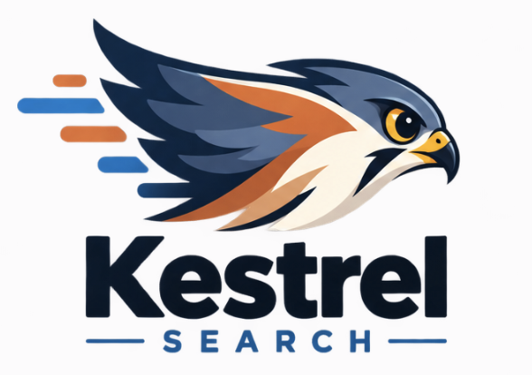

# Kestrel Search

<p align="center">
  
</p>

Kestrel Search is a local web-search capability for coding assistants. Install it once, let your assistant discover its generated `SKILL.md`, and it can search the web, retrieve readable page content, and return focused results while you stay in your coding workflow.

Under the hood, it searches DuckDuckGo, fetches result pages concurrently, extracts their main text, and re-ranks the results with BM25. The command line stays pipe-friendly: data goes to stdout and progress goes to stderr.

> **Note** Kestrel Search is an independent project and is not affiliated with DuckDuckGo.

## Install

Requires Python 3.13 or later.

```bash
# With uv
uv tool install kestrelsearch

# Or with pip
pip install kestrelsearch
```

## Quick start

```bash
# Search, fetch the matching pages, and rank them by relevance
kestrelsearch search "python dataclasses"

# Send structured results to another program or agent
kestrelsearch search "rust ownership" --output json

# A fast snippet-only search, without fetching pages
kestrelsearch search "openai news" --no-fetch
```

## What it does

- Searches DuckDuckGo’s HTML endpoint, with optional region and recency filters.
- Fetches result pages concurrently over HTTP/2.
- Removes common page chrome and extracts headings, paragraphs, and list content.
- Re-ranks fetched results against the original query using BM25.
- Returns readable terminal output or clean JSON.

## For agents

Use JSON output when Kestrel Search is called from an agent, script, or pipeline. Progress messages are written to stderr, leaving stdout safe to parse.

```bash
kestrelsearch search "recent Python packaging changes" \
  --time-filter m \
  --top-k 3 \
  --output json > results.json
```

Each result contains the search metadata plus extracted content when fetching is enabled:

| Field | Description |
| --- | --- |
| `title` | Result title |
| `url` | Result URL |
| `display_url` | Shortened URL shown in the search result |
| `snippet` | Search-result snippet |
| `content` | Extracted page text, prefixed with its source URL; `null` if unavailable |
| `bm25_score` | Relevance score when ranking is enabled |

To make the command discoverable to supported coding agents, install its generated `SKILL.md`:

```bash
# Prompts for the agent and whether to install locally or globally
kestrelsearch skill install

# Or install for every supported agent without prompts
kestrelsearch skill install --agent all --scope global
```

It supports Claude Code, Codex, and GitHub Copilot in VS Code. Use `--agent claude`, `--agent codex`, or `--agent vscode` to target one agent; `--agent both` remains available for Claude Code and VS Code Copilot. Installed skill locations are tracked locally, so `kestrelsearch skill uninstall` can remove them later.

| Agent | Project install | Global install |
| --- | --- | --- |
| Claude Code | `.claude/skills/kestrelsearch/SKILL.md` | `~/.claude/skills/kestrelsearch/SKILL.md` |
| Codex | `.codex/skills/kestrelsearch/SKILL.md` | `~/.codex/skills/kestrelsearch/SKILL.md` |
| GitHub Copilot in VS Code | `.github/skills/kestrelsearch/SKILL.md` | `~/.copilot/skills/kestrelsearch/SKILL.md` |

## Useful options

```bash
# Return three results
kestrelsearch search "climate change" --top-k 3

# Limit results to the past day; use d, w, m, or y
kestrelsearch search "breaking news" --time-filter d

# Narrow the DuckDuckGo region
kestrelsearch search "local elections" --region us-en

# Tune fetching for a pipeline
kestrelsearch search "machine learning" \
  --concurrency 8 --timeout 15 --content-limit 3000

# Keep DuckDuckGo ordering rather than applying BM25 ranking
kestrelsearch search "python typing" --no-rank
```

Run `kestrelsearch search --help` for the complete CLI reference.

## How it works

1. Kestrel Search submits the query to DuckDuckGo’s HTML endpoint and parses the result list.
2. Unless `--no-fetch` is used, it fetches eligible result pages concurrently.
3. It strips common boilerplate, focuses on likely main content, and keeps meaningful headings and body text.
4. BM25 scores the extracted text against the original query and returns the best matches.

PDFs are skipped during page fetching. If fetching or extraction fails for a result, the result is retained with `content: null`; BM25 ranking may omit zero-relevance results.

## Development

```bash
git clone https://github.com/rafaelpierre/kestrelsearch
cd kestrelsearch
uv sync
uv run kestrelsearch search "test"
```
